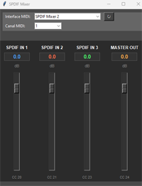

# Asynchronous S/PDIF Mixer

"Asynchronous SPDIF Mixer" is a hardware and software project designed to synchronize and mix up to three asynchronous S/PDIF streams into a single 48 kHz output stream.  
The system compensates for drift between sources and uses interpolation to ensure smooth and artifact-free audio transitions.  
The project includes USB-MIDI control, allowing real-time mixing of the three audio channels via an external MIDI controller or any MIDI-compatible software.
  
The software, developed in C++ with CubeIDE, is optimized for real-time audio processing and runs on an STM32H743 microcontroller.  
A custom electronic board, designed with KiCad, provides a dedicated hardware platform for this solution.  
  

## 📋 New Evolutions

Recent updates to the project include:

- 🔄 **Enhanced Drift Compensation**: A new algorithm has been implemented for compensating drifts in the input frequencies, ensuring more precise synchronization across streams.
- 🎛️ **Advanced Mixing Controls**: Mixing between the three inputs can now be adjusted in real-time via MIDI over USB, complemented by a Python-based control panel for intuitive configuration. Mix settings are automatically saved and recalled as presets stored directly in flash memory for persistent, non-volatile access.

## 👤 Author

This project is developed by **DAD Design**.

## 📄 License

This project is licensed under the [MIT License](LICENSE).

## ✨ Features

- **Synchronization of Asynchronous S/PDIF Streams:** The project synchronizes three input audio streams, each potentially running at different sample rates ( 48kHz, 44.1kHz, 32kHz), into a unified output stream at 48kHz.
- **Clock Drift Compensation:** Drift between the input streams is handled through periodic drift factor recalculation, ensuring the output remains smooth and synchronized.
- 🎛️ **Real-Time Mixing Controls**: Adjustable mixing levels for the three inputs via any USB-MIDI interface. A Python control panel included as an example for easy configuration.
- 💾 **Preset Memorization**: Mix settings are automatically saved and can be recalled as presets stored in flash memory for quick, persistent access.

## 🛠️ Hardware Platform

The KiCAD folder contains the schematics and PCB files for the project's hardware. These files were created using **KiCAD version 9.0**.

## 🔧 Development Environment

The project is developed and compiled using the **CubeIDE** environment provided by STMicroelectronics. CubeIDE is a fully integrated development environment (IDE) that supports STM32 microcontrollers and provides tools for debugging, flashing, and developing embedded systems.
