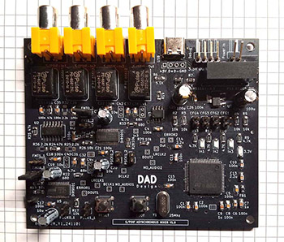
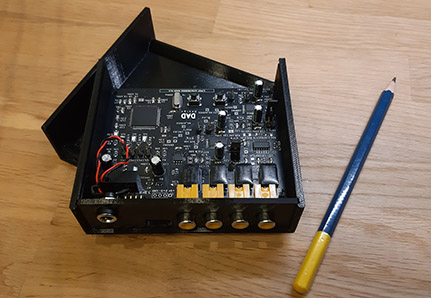

# Asynchronous S/PDIF Mixer
"Asynchronous S/PDIF Mixer" is a C++ solution designed to synchronize and mix three asynchronous S/PDIF streams into a single S/PDIF output stream at 48kHz. It compensates for drift and uses interpolation for smooth audio transitions, developed for the STM32H743 and built using CubeIDE for real-time audio processing.

 
## Author
This project is developed by **DAD Design**.
## License
This project is licensed under the [MIT License](LICENSE).
## Evolutions
Recent updates to the project include:  
- **Addition of a third input**: Support for an additional audio stream has been integrated.  
- **Development of a dedicated PCB**: A printed circuit board (PCB) has been designed to host the software.  

## Features
- **Synchronization of Asynchronous S/PDIF Streams:**  
  The project synchronizes three input audio streams, each potentially running at different sample rates (96kHz, 48kHz, 44.1kHz, 32kHz), into a unified output stream at 48kHz.
  
- **Clock Drift Compensation:**  
  Drift between the input streams is handled through periodic drift factor recalculation, ensuring the output remains smooth and synchronized.

## Hardware Platform
The `KiCAD` folder contains the schematics and PCB files for the project's hardware. These files were created using **KiCAD version 8.0**.

## Development Environment
The project is developed and compiled using the **CubeIDE** environment provided by STMicroelectronics. CubeIDE is a fully integrated development environment (IDE) that supports STM32 microcontrollers and provides tools for debugging, flashing, and developing embedded systems.
